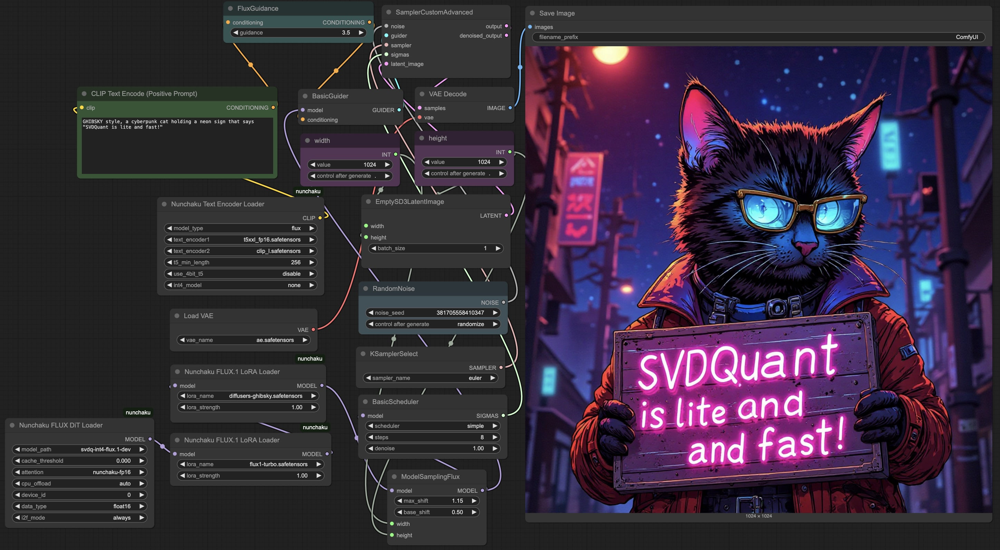

<div align="center" id="nunchaku_logo">
  </img>
</div>
<h3 align="center">
<a href="http://arxiv.org/abs/2411.05007"><b>Paper</b></a> | <a href="https://hanlab.mit.edu/projects/svdquant"><b>Website</b></a> | <a href="https://hanlab.mit.edu/blog/svdquant"><b>Blog</b></a> | <a href="https://svdquant.mit.edu"><b>Demo</b></a> | <a href="https://huggingface.co/collections/mit-han-lab/svdquant-67493c2c2e62a1fc6e93f45c"><b>HuggingFace</b></a> | <a href="https://modelscope.cn/collections/svdquant-468e8f780c2641"><b>ModelScope</b></a>
</h3>

This repository provides the ComfyUI node for [**Nunchaku**](https://github.com/mit-han-lab/nunchaku), an efficient inference engine for 4-bit diffusion models quantized with [SVDQuant](http://arxiv.org/abs/2411.05007). For the quantization library, check out [DeepCompressor](https://github.com/mit-han-lab/deepcompressor).

Join our user groups on [**Slack**](https://join.slack.com/t/nunchaku/shared_invite/zt-3170agzoz-NgZzWaTrEj~n2KEV3Hpl5Q) and [**WeChat**](https://github.com/mit-han-lab/nunchaku/blob/main/assets/wechat.jpg?raw=true) for discussions—details [here](https://github.com/mit-han-lab/nunchaku/issues/149). If you have any questions, run into issues, or are interested in contributing, feel free to share your thoughts with us!

# Nunchaku ComfyUI Node


## Installation

Please first install `nunchaku` following the instructions in [README.md](https://github.com/mit-han-lab/nunchaku?tab=readme-ov-file#installation). 

**[Optional]** You need to install `image_gen_aux` if you use `FluxDepthPreprocessor` node:

```shell
pip install git+https://github.com/asomoza/image_gen_aux.git
```

### Comfy-CLI

You can easily use [`comfy-cli`](https://github.com/Comfy-Org/comfy-cli) to run ComfyUI with Nunchaku:

```shell
pip install comfy-cli  # Install ComfyUI CLI  
comfy install          # Install ComfyUI  
comfy node registry-install nunchaku  # Install Nunchaku  

```

### ComfyUI-Manager

1. Install [ComfyUI](https://github.com/comfyanonymous/ComfyUI/tree/master) with 

   ```shell
   git clone https://github.com/comfyanonymous/ComfyUI.git
   cd ComfyUI
   pip install -r requirements.txt
   ```

2. Install [ComfyUI-Manager](https://github.com/ltdrdata/ComfyUI-Manager) with the following commands:

   ```shell
   cd custom_nodes
   git clone https://github.com/ltdrdata/ComfyUI-Manager comfyui-manager
   ```

3. Launch ComfyUI

   ```shell
   cd ..  # Return to the ComfyUI root directory  
   python main.py
   ```

4. Open the Manager, search `nunchaku` in the Custom Nodes Manager and then install it.


### Manual Installation
1. Set up [ComfyUI](https://github.com/comfyanonymous/ComfyUI/tree/master) with the following commands:

   ```shell
   git clone https://github.com/comfyanonymous/ComfyUI.git
   cd ComfyUI
   pip install -r requirements.txt
   ```

2. Clone this repository into the `custom_nodes` directory inside ComfyUI:

   ```shell
   cd custom_nodes
   https://github.com/mit-han-lab/ComfyUI-nunchaku
   ```

## Usage

1. **Set Up ComfyUI and Nunchaku**:

     * Nunchaku workflows can be found at [`workflows`](./workflows). To use them, copy the files to `user/default/workflows` in the ComfyUI root directory:

       ```shell
       cd ComfyUI
       
       # Create the workflows directory if it doesn't exist
       mkdir -p user/default/workflows
       
       # Copy workflow configurations
       cp custom_nodes/ComfyUI-nunchaku/workflows/* user/default/workflows/
       ```

     * Install any missing nodes (e.g., `comfyui-inpainteasy`) by following [this tutorial](https://github.com/ltdrdata/ComfyUI-Manager?tab=readme-ov-file#support-of-missing-nodes-installation).

2. **Download Required Models**: Follow [this tutorial](https://comfyanonymous.github.io/ComfyUI_examples/flux/) to download the necessary models into the appropriate directories. Alternatively, use the following commands:

   ```shell
   huggingface-cli download comfyanonymous/flux_text_encoders clip_l.safetensors --local-dir models/text_encoders
   huggingface-cli download comfyanonymous/flux_text_encoders t5xxl_fp16.safetensors --local-dir models/text_encoders
   huggingface-cli download black-forest-labs/FLUX.1-schnell ae.safetensors --local-dir models/vae
   ```

3. **Run ComfyUI**: To start ComfyUI, navigate to its root directory and run `python main.py`. If you are using `comfy-cli`, simply run `comfy launch`.

4. **Select the Nunchaku Workflow**: Choose one of the Nunchaku workflows (workflows that start with `nunchaku-`) to get started. For the `flux.1-fill` workflow, you can use the built-in **MaskEditor** tool to apply a mask over an image.

5. All the 4-bit models are available at our [HuggingFace](https://huggingface.co/collections/mit-han-lab/svdquant-67493c2c2e62a1fc6e93f45c) or [ModelScope](https://modelscope.cn/collections/svdquant-468e8f780c2641) collection. Except [`svdq-flux.1-t5`](https://huggingface.co/mit-han-lab/svdq-flux.1-t5), please download the **entire model folder** to `models/diffusion_models`.

## Nunchaku Nodes

* **Nunchaku Flux DiT Loader**: A node for loading the FLUX diffusion model. 

  * `model_path`: Specifies the model's location. You need to manually download the model folder from our [Hugging Face](https://huggingface.co/collections/mit-han-lab/svdquant-67493c2c2e62a1fc6e93f45c) or [ModelScope](https://modelscope.cn/collections/svdquant-468e8f780c2641) collection. For example, run

    ```shell
    huggingface-cli download mit-han-lab/svdq-int4-flux.1-dev --local-dir models/diffusion_models/svdq-int4-flux.1-dev
    ```

    After downloading, set `model_path` to the corresponding folder name. 

    **Note: If you rename the model folder, ensure that `comfy_config.json` is present in the folder. You can find this file in our corresponding repositories on [Hugging Face](https://huggingface.co/collections/mit-han-lab/svdquant-67493c2c2e62a1fc6e93f45c) or [ModelScope](https://modelscope.cn/collections/svdquant-468e8f780c2641).**

  * `cpu_offload`: Enables CPU offloading for the transformer model. While this reduces GPU memory usage, it may slow down inference.

    - When set to `auto`, it will automatically detect your available GPU memory. If your GPU has more than **14GiB** of memory, offloading will be disabled. Otherwise, it will be enabled.
    - **Memory usage will be further optimized in node v0.2.**

  * `device_id`: Indicates the GPU ID for running the model.

* **Nunchaku FLUX LoRA Loader**: A node for loading LoRA modules for SVDQuant FLUX models.

  * Place your LoRA checkpoints in the `models/loras` directory. These will appear as selectable options under `lora_name`.
  * `lora_format` specifies the LoRA format. Supported formats include:
    * `auto`: Automatically detects the appropriate LoRA format.
    * `diffusers` (e.g., [aleksa-codes/flux-ghibsky-illustration](https://huggingface.co/aleksa-codes/flux-ghibsky-illustration))
    * `comfyui` (e.g., [Shakker-Labs/FLUX.1-dev-LoRA-Children-Simple-Sketch](https://huggingface.co/Shakker-Labs/FLUX.1-dev-LoRA-Children-Simple-Sketch))
    * `xlab` (e.g., [XLabs-AI/flux-RealismLora](https://huggingface.co/XLabs-AI/flux-RealismLora))
    * `svdquant` (e.g., [mit-han-lab/svdquant-lora-collection](https://huggingface.co/mit-han-lab/svdquant-lora-collection)).

  * `base_model_name`: Specifies the path to the quantized base model. If `lora_format` is set to `svdquant`, this option is ignored. You can set it to the same value as `model_path` in the **SVDQuant FLUX DiT Loader**.
  * `lora_strength`: Controls the strength of the LoRA module.
  * `save_converted_lora`: If enabled, non-SVDQuant LoRA models will be converted and saved to disk, reducing conversion time in future runs. The converted LoRA will be stored in the same folder with the filename format: `svdq-{precision}-{name}.safetensors`.
  * **Note**: Currently, only **one** LoRA can be loaded at a time. **Multi-LoRA support will be added in node v0.2.**

* **Nunchaku Text Encoder Loader**: A node for loading the text encoders.

  * For FLUX, use the following files:

    - `text_encoder1`: `t5xxl_fp16.safetensors` (or FP8/GGUF versions of T5 encoders).
    - `text_encoder2`: `clip_l.safetensors`

  * `t5_min_length`: Sets the minimum sequence length for T5 text embeddings. The default in `DualCLIPLoader` is hardcoded to 256, but for better image quality, use 512 here.

  * `use_4bit_t5`: Specifies whether you need to use our quantized 4-bit T5 to save GPU memory.

  * `int4_model`: Specifies the INT4 T5 location. This option is only used when `use_4bit_t5` is enabled. You can download our INT4 T5 model folder to `models/text_encoders` from [HuggingFace](https://huggingface.co/mit-han-lab/svdq-flux.1-t5) or [ModelScope](https://modelscope.cn/models/Lmxyy1999/svdq-flux.1-t5). For example, you can run the following command:

       ```shell
       huggingface-cli download mit-han-lab/svdq-flux.1-t5 --local-dir models/text_encoders/svdq-flux.1-t5
       ```

       After downloading, specify the corresponding folder name as the `int4_model`.


  * **Note**: Currently, loading the **4-bit T5 model** consumes excessive memory. **We will optimize this in node v0.2.**

* **FLUX.1 Depth Preprocessor**: A node for loading the depth estimation model and output the depth map. `model_path` specifies the model location. You can manually download the model repository from [Hugging Face](https://huggingface.co/LiheYoung/depth-anything-large-hf) and place it in the `models/checkpoints` directory. To download via CLI, run:

  ```shell
  huggingface-cli download LiheYoung/depth-anything-large-hf --local-dir models/checkpoints/depth-anything-large-hf
  ```

  

